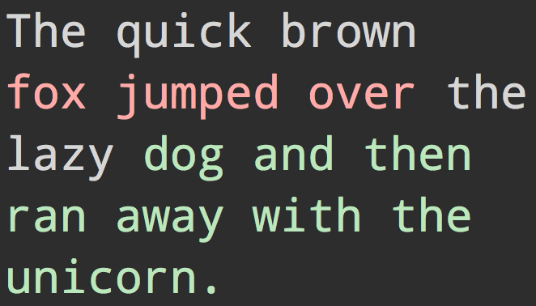

# wrap-ansi [](https://travis-ci.org/chalk/wrap-ansi) [](https://coveralls.io/github/chalk/wrap-ansi?branch=master)

> Wordwrap a string with [ANSI escape codes](http://en.wikipedia.org/wiki/ANSI_escape_code#Colors_and_Styles)

## Install

```
$ npm install --save wrap-ansi
```


## Usage

```js
var chalk = require('chalk');
var wrapAnsi = require('wrap-ansi');

var input = 'The quick brown ' + chalk.red('fox jumped over ') +
	'the lazy ' + chalk.green('dog and then ran away with the unicorn.');

console.log(wrapAnsi(input, 20));
```




## API

### wrapAnsi(input, columns, opts)

wrap words to the specified column width. By default the wrap is
`soft`, so long words may extend past the column length.

the following options can be provided:

* `hard`: `boolean`, should hard wrapping be enabled?

#### input

Type: `string`

String with ANSI escape codes. Like one styled by [`chalk`](https://github.com/chalk/chalk).

#### columns

Type: `number`

Number of columns to wrap the text to.


## Related

- [slice-ansi](https://github.com/chalk/slice-ansi) - Slice a string with ANSI escape codes
- [chalk](https://github.com/chalk/chalk) - Terminal string styling done right
- [jsesc](https://github.com/mathiasbynens/jsesc) - Generate ASCII-only output from Unicode strings. Useful for creating testing fixtures.

## License

MIT © [Sindre Sorhus](http://sindresorhus.com)
